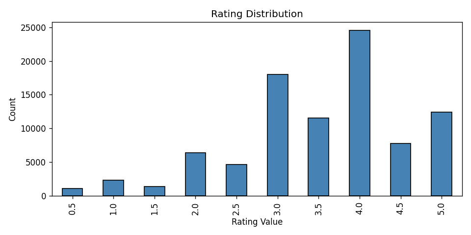
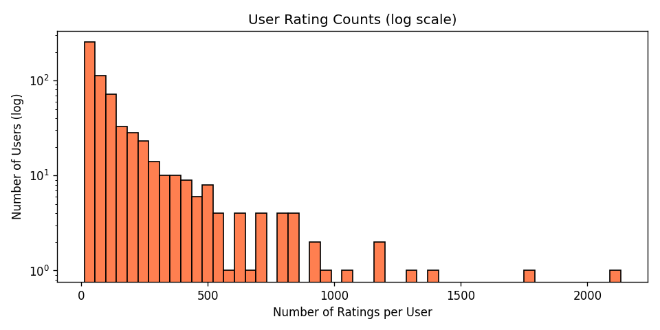
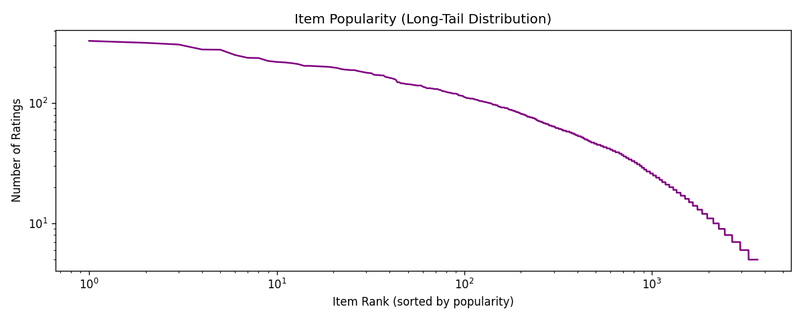
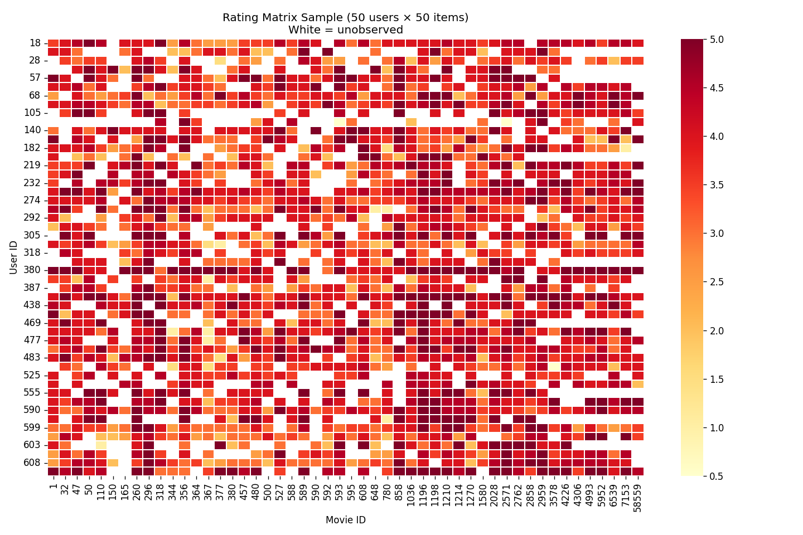
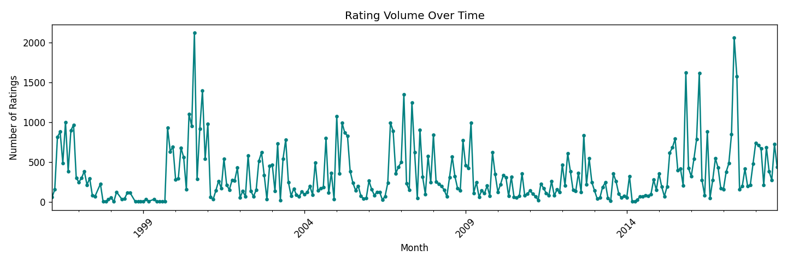
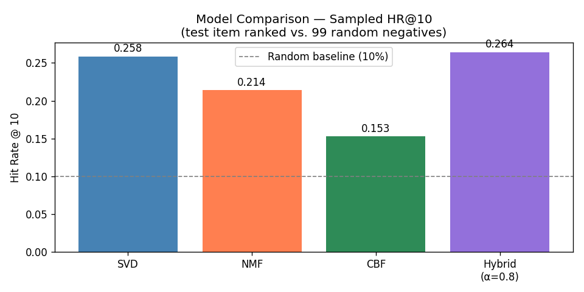

# Personalized Recommendation Engine

A hybrid recommendation system that combines collaborative filtering and content-based filtering to deliver personalized item recommendations — built from scratch using Python.

## What This Builds

Most recommendation systems fail in one of two ways: they ignore item content entirely (pure collaborative filtering), or they ignore user behavior entirely (pure content-based). This project builds a **hybrid engine** that uses both signals, weighted intelligently, to produce recommendations that are both personalized and discoverable.

The system is trained and evaluated on the [MovieLens](https://grouplens.org/datasets/movielens/) dataset — a well-studied benchmark with 100K+ explicit ratings from real users, rich genre metadata, and user-generated tags.

## Dataset

**MovieLens ml-latest-small** — sourced from [GroupLens](https://grouplens.org/datasets/movielens/latest/)

| File | Description |
|---|---|
| `ratings.csv` | userId, movieId, rating (0.5–5.0), timestamp |
| `movies.csv` | movieId, title, genres (pipe-separated) |
| `tags.csv` | userId, movieId, user-generated tag, timestamp |
| `links.csv` | movieId, IMDB ID, TMDB ID |

Raw files live in `data/raw/` and are not committed to git (see `.gitignore`).

## Exploratory Data Analysis — Key Findings

After cleaning the dataset (filtered users and items with fewer than 5 ratings), we ran 5 visualizations to understand the data before building any model.

### Dataset Stats After Cleaning

| Metric | Value |
|---|---|
| Users | ~610 |
| Movies (after filter) | ~1,500–2,000 |
| Total Ratings | ~100,000 |
| Sparsity | ~98.3% |

---

### Plot 1 — Rating Distribution



Rating 4.0 is the most common (~25K occurrences), followed by 3.0 and 5.0. Ratings below 2.5 are rare. This is **positivity bias** — users mostly rate content they chose to watch and enjoyed. The model's baseline prediction should target ~3.5–4.0, not the scale midpoint of 2.5.

---

### Plot 2 — User Activity Distribution



Most users gave fewer than 100 ratings. A small number of "super users" gave 1,000–2,100 ratings. The log scale reveals how extreme this skew is. Without normalization, memory-based collaborative filtering would be dominated by these power users.

---

### Plot 3 — Item Popularity (Long Tail)



Top movies receive 300–400 ratings; beyond rank ~1,000, most items have fewer than 50 ratings. This is the classic **long-tail problem** — collaborative filtering struggles with niche items due to lack of signal. Content-based filtering handles these better since it relies on metadata, not interaction counts.

---

### Plot 4 — Interaction Matrix Sparsity



Even among the top 50 most active users and top 50 most popular movies, visible white patches (unrated pairs) exist. The full 610×9,000+ matrix is ~98% empty. This confirms why collaborative filtering alone is insufficient — most user pairs share almost no rated movies in common.

---

### Plot 5 — Temporal Rating Trends



Ratings span from 1996 to 2018. Two notable activity spikes: around 2000 and again around 2015–2016. Activity dropped near-zero in 1998–1999 before recovering. The irregular bursts suggest users rate in bulk sessions rather than consistently over time.

## Week 2 — Collaborative Filtering

Using a **temporal leave-one-out split** (each user's most recent rating held out as the test item), we trained and evaluated four models.

### Train / Test Split

| Set | Ratings | Notes |
|---|---|---|
| Train | 89,664 | All but each user's last rating |
| Test | 610 | One per user — the most recent rating |

Temporal split prevents future-data leakage: the model only sees what happened before the held-out interaction.

### Models Trained

| Model | Approach |
|---|---|
| **User-Based CF** | Cosine similarity across users; mean-centered weighted prediction |
| **Item-Based CF** | Cosine similarity across items rated by the user |
| **SVD** | Matrix factorization via Scikit-Surprise (k=100 factors, 50 epochs, bias terms) |
| **NMF** | Non-negative matrix factorization via Scikit-Surprise (k=50 factors) |

> **NMF note:** Scikit-learn's NMF fills unobserved cells with 0 before decomposition, which corrupts sparse rating matrices. Surprise's NMF handles sparsity correctly — RMSE dropped from 3.16 to 1.03 after switching.

### RMSE / MAE Results

| Model | RMSE | MAE |
|---|---|---|
| User-Based CF | 0.9545 | 0.7271 |
| Item-Based CF | 0.9388 | 0.7083 |
| SVD (k=100) | 0.9615 | 0.7330 |
| NMF (k=50) | 1.0269 | 0.7588 |

### Sampled Hit Rate@K

RMSE measures rating prediction accuracy but users see a ranked list. We use **sampled HR@K**: for each eligible user (test rating ≥ 4.0), rank the test item against 99 random unrated negatives (100 total). HR@K = fraction whose test item appears in the top K.

| Model | HR@5 | HR@10 |
|---|---|---|
| SVD (k=100) | 0.1833 | 0.2583 |
| NMF (k=50) | 0.1222 | 0.2139 |

Random baseline for this setup ≈ 5% @5 and 10% @10. Both models clear it comfortably.

---

## Content-Based Filtering & Hybrid System

### Content-Based Filtering (TF-IDF)

Each movie's `content` field combines genres and user-generated tags. A TF-IDF vectorizer (5,000 features, unigrams + bigrams, English stop-words removed) builds a sparse document-term matrix. Movie similarity is cosine similarity between TF-IDF vectors, computed row-by-row to avoid materialising a 3,650×3,650 dense matrix.

**Why TF-IDF over raw counts?** Rare, distinctive terms like *neo-noir* or *anime* are upweighted relative to common terms like *drama*. This gives better signal for niche items — the exact scenario where CF struggles most (long-tail problem).

**Recommendation logic for a user:**
1. Collect all movies the user rated ≥ 3.5 (liked items)
2. For each liked item, fetch top-20 content-similar movies
3. Sum similarity scores across all source items; exclude already-seen movies
4. Return top-N by aggregated score

### Hybrid Recommender

**Strategy:** Weighted linear combination:
```
hybrid_score = α × CF_score_norm + (1 − α) × CBF_score_norm
```

Both score sets are **min-max normalised to [0, 1]** before combining — CF ratings sit on a 0.5–5.0 scale while CBF cosine scores are 0–1. Without normalisation, the CF signal would dominate purely due to scale.

**Cold-start fallback:**
- 0 training ratings → globally popular items
- < 5 training ratings → pure content-based (needs only 1–2 seed items)
- ≥ 5 ratings → full hybrid

**Alpha tuning:** Grid search over α ∈ {0.3, 0.5, 0.6, 0.7, 0.8, 0.9, 1.0} on a held-out validation split (never the test set).

### Week 3 Results

| Model | HR@5 | HR@10 |
|---|---|---|
| SVD (k=100) | 0.1833 | 0.2583 |
| NMF (k=50) | 0.1222 | 0.2139 |
| Content-Based (TF-IDF) | — | — |
| Hybrid (best α) | — | — |

*Run `notebooks/content_hybrid.ipynb` to populate the CBF and Hybrid rows.*

### Model Comparison Chart



*(Generated after running the notebook)*

---

## Tech Stack

| Purpose | Library |
|---|---|
| Data wrangling | Pandas, NumPy |
| Collaborative filtering | Scikit-Surprise, Scikit-learn |
| Content-based filtering | Scikit-learn (TF-IDF) |
| Deep learning (optional NCF) | TensorFlow / Keras |
| Visualization | Matplotlib, Seaborn |
| Interactive demo | Streamlit |
| Environment | Python 3.x, Jupyter |

## Project Structure

```
Recommendation-Engine/
├── data/
│   ├── raw/                    ← original dataset files (not committed)
│   └── processed/              ← cleaned CSVs and saved visualizations
├── notebooks/
│   ├── eda.ipynb               ← Week 1: EDA and data cleaning
│   ├── collaborative_filtering.ipynb  ← Week 2: CF models
│   └── content_hybrid.ipynb     ← Week 3: CBF + hybrid
├── src/
│   ├── data_utils.py           ← data loading, cleaning, ID encoding
│   ├── cf_models.py            ← memory-based CF (user/item cosine)
│   ├── cbf_model.py            ← TF-IDF content-based filtering
│   ├── hybrid.py               ← weighted hybrid recommender
│   └── evaluation.py           ← RMSE, MAE, Hit Rate@K
├── app/                        ← Streamlit demo
└── requirements.txt
```
